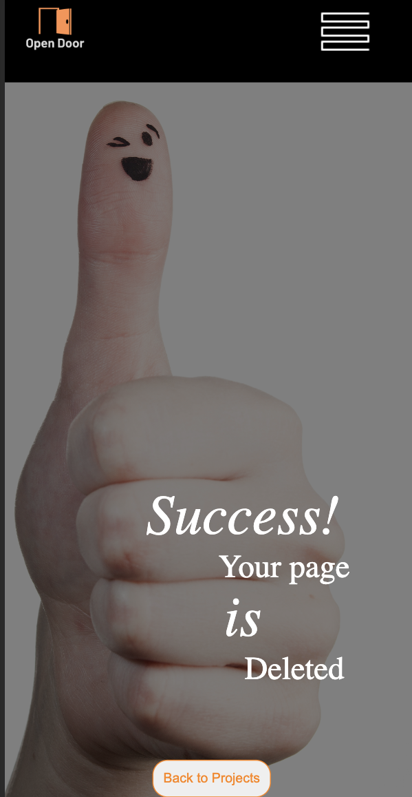

# Crowdfunding Project (Front end with React JS)

  

## OpenDoor by Karla Gaudet

[View live site here](https://opendoor.netlify.app/)

OpenDoor is a crowdfunding site that allows people to ask for financial sponsorships that will aid the sponsee to pay for study fees and/or study equipment and tools.

### Intended Audience/User Stories
OpenDoor is intended for anyone with a plan to pursue a study path to further their education and for sponsors to aid in gifting funds for that person to reach their goals.

## Features:
### Homepage -

  
| Video Autoplay |  Carousel of Projects | Ttl owners Ttl $ raised | 
|:-----|:--------:|------:|
| 

| 

 | 

 |

### Category & Project Page -

| Categories of Projects | Pledges with amounts and comments 
| ------------- | ------------- 
| 

  | 

  | 

### Create Page -

| Create a new project form 
| ------------- 
| 

  | 

### Login / Sign Up

| Login or Sign up Form 
| ------------- 
| 

  | 

### Permissions

| Delete if authorised |  Are you sure check | Delete confirmation | 
|:-----|:--------:|------:|
| 

| 

 | 

 |

### WishList:
* Update feature
* Custom Error Pages
* CSS Animations
* User Profile with edit/delete functionality
* Edit/Delete Pledges
* Handle Window Storage deletion
* Category drop down (get data from API backend) for project option 
* "$" sign in pledge counter 

#### References and Resources:

https://developer.mozilla.org/en-US/docs/Web/JavaScript/Reference/Global_Objects/Math/random

https://stackoverflow.com/questions/67243653/how-can-i-have-an-image-that-changes-every-5-seconds-in-react-js

https://developer.mozilla.org/en-US/docs/Web/API/setInterval

https://stackoverflow.com/questions/16449295/how-to-sum-the-values-of-a-javascript-object#:~:text=It%20can%20be%20as%20simple,%3E%20a%20%2B%20b%2C%200)%3B

https://reactrouter.com/en/main/hooks/use-navigate

https://dev.to/thatfemicode/passing-data-states-through-react-router-8dh

https://medium.com/yavar/how-to-use-the-reduce-in-javascript-and-react-4bc8b5f8fa4b

https://developer.mozilla.org/en-US/docs/Web/JavaScript/Reference/Global_Objects/Object/keys

https://stackoverflow.com/questions/42118296/dynamically-import-images-from-a-directory-using-webpack

https://codesandbox.io/p/sandbox/animated-react-js-counter-0uowr?file=%2Fsrc%2FApp.js